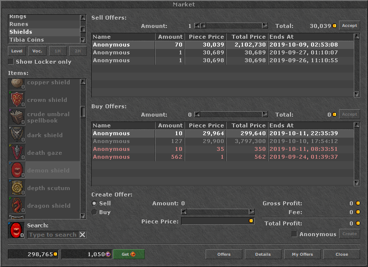

# fake-market 
tibia otserver with fake market, for testing.



# Sql Querys for the database
- items, armors, weapons, rings and amulets

# Upgrade Tier

```
INSERT INTO `market_offers` (`player_id`, `sale`, `itemtype`, `amount`, `created`, `anonymous`, `price`, `tier`) VALUES
(1, 1, 814, 999999, UNIX_TIMESTAMP(), 1, 22, 0)
```

```
INSERT INTO `market_offers` (`player_id`, `sale`, `itemtype`, `amount`, `created`, `anonymous`, `price`, `tier`) VALUES
(1, 1, 814, 999999, UNIX_TIMESTAMP(), 1, 22, **1**)
```
